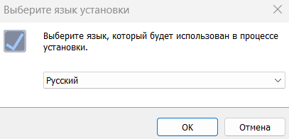
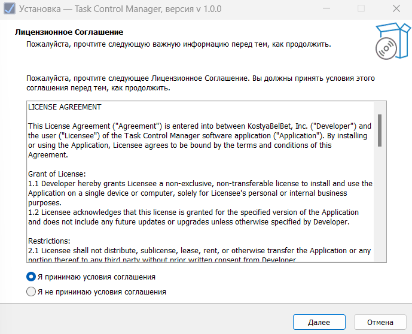
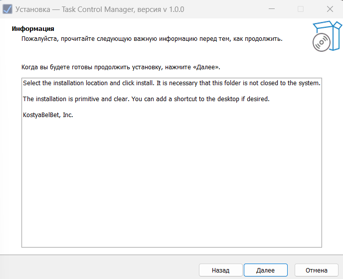
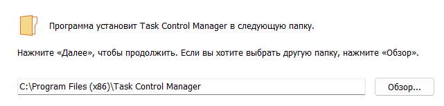
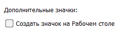
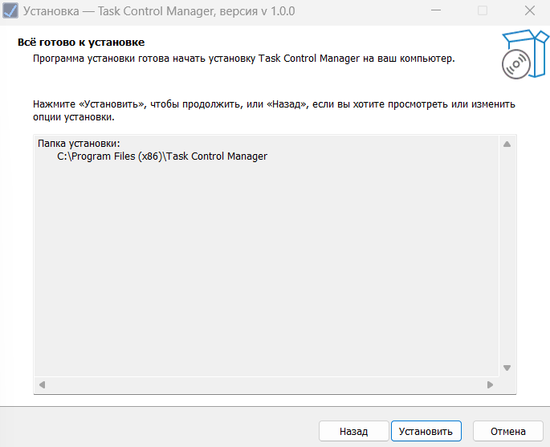

"Task control manager" приложение призванное помочь людям побороть своб лень в выполнении задач.
Добавив в обычный планировщик задач аркадную черту, мы поднимаем вашу мотивацию!

## Как установить приложение
На данный момент доступна только первая релиз версия приложения.
Для того, чтобы установить "Task Control Manager" к себе на устройство вы должны знать, 
что работает оно только для платформы Windows. На Windows 10/11 всё работает хорошо.
Если ваш компьютер имеет ОС Windows и вы готовы то в данном репозитории есть вкладка Releas,
где расположены все версии приложения. Скачивайте файлы приложения и используйте.

В скаченых вами файлах будет 2 архива .zip и установщий приложение .exe.
 - В .zip архивах вы найдёте исходный код программы;
 - Через установщик вы установите данное приложение.

 ## Установка через TSMSetup.exe
 
 По двойному нажатию на установочный файл у вас  откроется окно установки приложения.
 
 Выберите из всего списка интересующий вас язык установки приложения и нажмите ОК.
 
 Прочитайте пользовательское соглашений, и, если вы со всем согласны, выберите пункт Я принимаю условия соглашения и нажмите Далее
 
 Краткая информация о том, как установить приложение. И нажмите Далее.
 
 Выберите место установки и нажмите Далее.
 
 В случае, если вы хотите создать ярлык на рабочем стале, то выберите соответствующий пункт и нажмите Далее.
 
 Финальный момент. У вас уточняется точно ли вы готовы к установке и если вам ответ положительный нажимаем Установить.