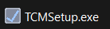
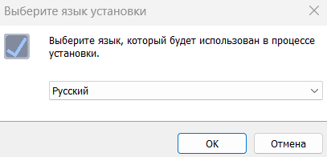
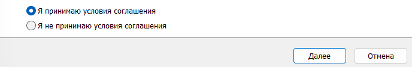
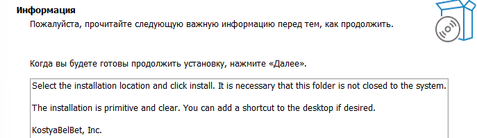
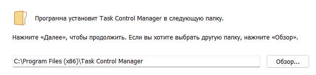
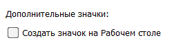
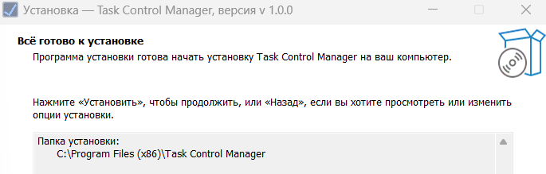

`Task control manager` - приложение призванное помочь людям побороть своб лень в выполнении задач. Добавив в обычный планировщик задач аркадную черту, мы поднимаем вашу мотивацию!

## Как установить приложение
На данный момент доступна только первая релиз версия приложения. Для того, чтобы установить `Task Control Manager` к себе на устройство вы должны знать, 
что работает оно только для платформы `Windows`. На `Windows 10/11` всё работает хорошо. Если ваш компьютер имеет `ОС Windows` и вы готовы то в данном репозитории есть вкладка `Releas`, где расположены все версии приложения. Скачивайте файлы приложения и используйте.

В скаченых вами файлах будет 2 архива `.zip` и `tar.gz` и установщий приложение `.exe`.
 - В архивах вы найдёте исходный код программы;
 - Через установщик вы установите данное приложение.

 ## Установка через `TSMSetup.exe`
 1. По двойному нажатию на установочный файл у вас откроется окно установки приложения.    
   
 
 2. Выберите из всего списка интересующий вас язык установки приложения и нажмите _`ОК`_.    
   
 
 3. Прочитайте пользовательское соглашений, и, если вы со всем согласны, выберите пункт _`Я принимаю условия соглашения`_ и нажмите _`Далее`_. Если вы не согласны с условиями нажмите _`Отмена`_ и установка будет отколнена.    
   
 
 4. Краткая информация о том, как установить приложение. Прочитайте её перед тем, как продолжить. И, когда будете готовы продолжить установвку, нажмите _`Далее`_.    
   
 
 5. Выберите место установки, то, в какую папку вы хотите установить _`Task Control Manager`_ и нажмите _`Далее`_.    
   
 
 6. Выберите дополнительные задачи, которые необходимо выполнить. В случае, если вы хотите создать ярлык на рабочем стале, то выберите соответствующий пункт и нажмите _`Далее`_.    
   
 
 7. Финальный момент. У вас уточняется точно ли вы готовы к установке и если вам ответ положительный нажимаем _`Установить`_. Если, вдруг, вы передумали, то нажмите _`Отмена`_.    
   

 